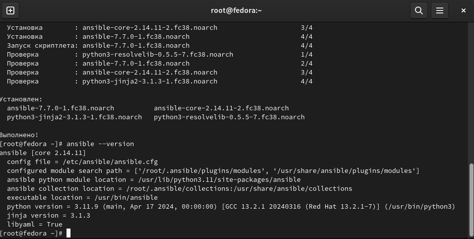
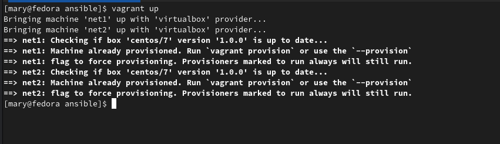
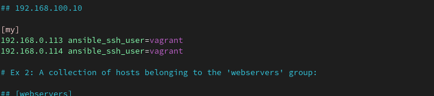
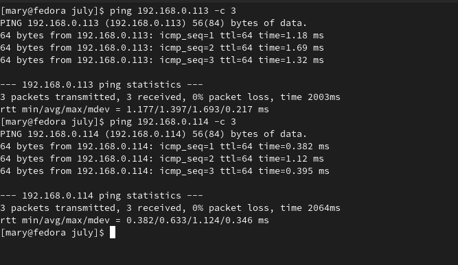
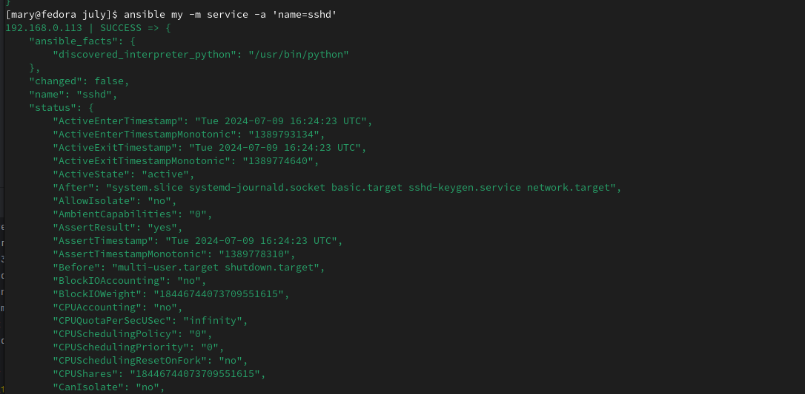

# Домашнее задание к занятию "Ansible. Часть 1" - Варфоломеева Марьяна

### Задание 1

Какие преимущества даёт подход IAC?

### Ответ

  * Нет необходимости в ручной настройке
  * Скорость — настройка («поднятие») инфраструктуры занимает
  заметно меньше времени
  * Воспроизводимость — поднимаемая инфраструктура всегда
  идентична
  * Масштабируемость — один инженер может с помощью
  одного и того же кода настраивать и управлять огромным
  количеством машин

---

### Задание 2

Выполните действия и приложите скриншоты действий.

  1. Установите Ansible.
  1. Настройте управляемые виртуальные машины, не меньше двух.
  1. Создайте файл inventory с созданными вами ВМ.
  1. Проверьте доступность хостов с помощью модуля ping.


### Ответ

1. Установка Ansible (ОС Fedora):

 ```>> dnf install ansible ```



2. Виртуальные машины настроены через Vagrantfile, предоставленный к лекции.

```>> vagrant up ```
   



в ходе установки виртуальные машины получили следующие ip-адреса (bridge):


3. Настроен inventory  файл с указанием полученных ip-адресов в группе новой группе "my":



4. Проверка доступности ВМ через пинг:



---

### Задание 3

Какая разница между параметрами forks и serial?

### Ответ

---

### Задание 4

В этом задании вы будете работать с Ad-hoc коммандами.

Выполните действия и приложите скриншоты запуска команд.

   1. Установите на управляемых хостах любой пакет, которого нет. 
   1. Проверьте статус любого, присутствующего на управляемой машине, сервиса.
   1. Создайте файл с содержимым «I like Linux» по пути /tmp/netology.txt.

### Ответ
1. Установка mc через модуль yum:
```>> ansible my -m yum -a "name=mc state=latest" -b```


1. Проверка статуса сервиса через модуль service:
```>> ansible my -m service -a 'name=sshd' ```
